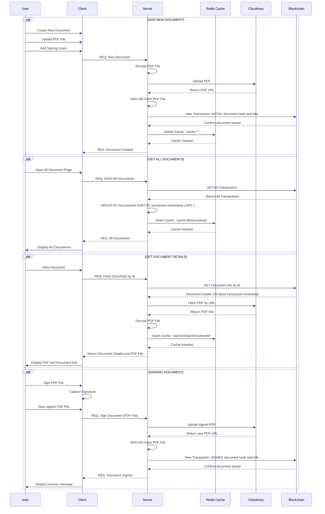

```mermaid
sequenceDiagram
    participant User
    participant Client
    participant Server
    participant Redis Cache
    participant Cloudinary
    participant Blockchain

opt ADD NEW DOCUMENT
    User->>Client: Create New Document
    User->>Client: Upload PDF File
    User->>Client: Add Signing Users
    Client->>Server: REQ: New Document
    Server->>Server: Encrypt PDF File
    Server->>Cloudinary: Upload PDF
    Cloudinary-->>Server: Return PDF URL

    Server->>Server: SHA-256 Hash PDF File
    Server->>Blockchain: New Transaction: INITIAL document hash and info
    Blockchain-->>Server: Confirm document stored

    Server->>Redis Cache: Delete Cache: "cache:*"
    Redis Cache-->>Server: Cache Cleared
    Server-->>Client: RES: Document Created
end

opt GET ALL DOCUMENTS
    User->>Client: Open All Document Page
    Client->>Server: REQ: Fetch All Documents
    Server->>Blockchain: GET All Transactions 
    Blockchain-->>Server: Return All Transactions

    Server->>Server: GROUP BY DocumentId SORT BY transaction-timestamp LIMIT 1

    Server->>Redis Cache: Insert Cache: "cache:AllDocuments"
    Redis Cache-->>Server: Cache Inserted

    Server-->>Client: RES: All Documents
    Client->>User: Display ALl Documents
end

opt GET DOCUMENT DETAILS
    User->>Client: View Document
    Client->>Server: REQ: Fetch Document by id
    Server->>Blockchain: GET Document info by id 
    Blockchain-->>Server: Document Details ON latest transaction-timestamp

    Server->>Cloudinary: Fetch PDF by URL
    Cloudinary-->>Server: Return PDF File
    Server->>Server: Decrypt PDF File

    Server->>Redis Cache: Insert Cache: "cache:Detail:DocumentId"
    Redis Cache-->>Server: Cache Inserted

    Server-->>Client: Return Document Details and PDF File
    Client->>User: Display PDF and Document Info
end

opt SIGNING DOCUMENT
    User->>Client: Sign PDF File
    Client->>Client: Capture Signature

    User->>Client: Save signed PDF File
    Client->>Server: REQ: Sign Document (PDF File)

    Server->>Cloudinary: Upload signed PDF
    Cloudinary-->>Server: Return new PDF URL
    Server->>Server: SHA-256 Hash PDF File

    Server->>Blockchain: New Transaction: SIGNED document hash and info
    Blockchain-->>Server: Confirm document stored
    Server-->>Client: RES: Document Signed

    Client->>User: Display success message
end
```
